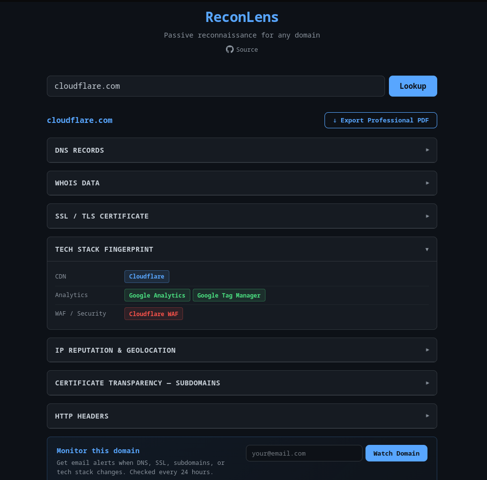

# ReconLens

Passive reconnaissance for any domain — DNS, WHOIS, SSL, tech stack, IP reputation, CT subdomains, and HTTP headers in one lookup. Exports a clean PDF report.



**Live demo:** https://reconlens.onrender.com

---

## Features

| Module | What it collects |
|---|---|
| **DNS Records** | A, MX, NS, TXT |
| **WHOIS** | Registrar, creation/expiry dates, name servers, org, country |
| **SSL / TLS** | Subject CN, issuer, validity window, days until expiry, SANs |
| **Tech Stack** | CDN, web server, CMS, language, JS frameworks, analytics, WAF, hosting — 60+ signatures |
| **IP Reputation** | Geolocation, ISP, ASN, proxy/VPN/hosting flags, Spamhaus + SpamCop DNSBL |
| **Certificate Transparency** | All subdomains ever issued a cert via crt.sh |
| **HTTP Headers** | Full response header set |
| **PDF Export** | Branded A4 report with expiry banners, tech badges, page numbers |
| **Domain Monitoring** | 24h checks — email alerts on DNS changes, new subdomains, SSL expiry, tech stack changes |

No install. No account. Enter a domain, get results in seconds.

---

## Tech Stack

| Layer | Technology |
|---|---|
| Backend | Python 3.12, FastAPI, Uvicorn |
| OSINT | dnspython, python-whois, requests, built-in ssl/socket |
| PDF | WeasyPrint (HTML → PDF) |
| Monitoring | APScheduler (24h jobs), SQLite |
| Email | Resend API |
| Rate limiting | slowapi (10 req/min lookup/export, 3 req/min watch) |
| Frontend | Vanilla HTML/CSS/JS, dark mode, no framework |

---

## Running Locally

```bash
# 1. Clone and create virtualenv
git clone https://github.com/egeisik35/reconlens.git
cd reconlens
python -m venv venv
source venv/bin/activate   # Windows: venv\Scripts\activate

# 2. Install dependencies
pip install -r backend/requirements.txt

# 3. Configure environment
cp .env.example .env
# Edit .env — add your RESEND_API_KEY for email alerts

# 4. Start the server
cd backend
uvicorn main:app --reload
```

Open `http://localhost:8000`.

### Environment Variables

| Variable | Required | Description |
|---|---|---|
| `RESEND_API_KEY` | For email alerts | API key from resend.com |
| `FROM_EMAIL` | No | Sender address (default: `onboarding@resend.dev`) |
| `DB_PATH` | No | Absolute path to SQLite file (default: `backend/monitors.db`) |
| `BASE_URL` | No | Public URL of your deployment — used in unsubscribe links |

---

## Deploying on Render

1. Fork this repo
2. Go to [render.com](https://render.com) → **New Web Service** → connect your fork
3. Render auto-detects the Dockerfile
4. Add environment variables in the Render dashboard:
   - `RESEND_API_KEY`
   - `FROM_EMAIL`
   - `BASE_URL` (your Render URL)
5. Deploy

> **Note:** The free tier uses an ephemeral filesystem — the SQLite database resets on redeploy. Mount a persistent disk or use an external database for production.

---

## Docker

```bash
docker build -t reconlens .

docker run -p 8000:8000 \
  -e RESEND_API_KEY=re_your_key \
  -e FROM_EMAIL=alerts@yourdomain.com \
  -e BASE_URL=https://yourdomain.com \
  -v /data/reconlens:/app/backend \
  reconlens
```

The `-v` mount persists the SQLite database across restarts.

---

## Security

- **SSRF protection** — all outbound connections validate the resolved IP against RFC1918, loopback, link-local, and reserved ranges
- **Input validation** — domain regex-validated on every endpoint; email validated on watch endpoint
- **Rate limiting** — 10 req/min per IP on lookup/export, 3 req/min on watch
- **Security headers** — `X-Content-Type-Options`, `X-Frame-Options`, `Referrer-Policy`, `X-XSS-Protection`
- **Error sanitisation** — raw exceptions logged server-side only; clients receive generic messages
- **Output escaping** — all user-derived data HTML-escaped before PDF rendering

---

## API

### `POST /api/lookup`
```json
{ "domain": "example.com" }
```
Returns structured JSON with `dns`, `whois`, `ssl`, `tech_stack`, `ip_reputation`, `ct`, `headers`, `errors`.

### `POST /api/export-pdf`
Accepts the same JSON shape as the lookup response. Returns `application/pdf`.

### `POST /api/watch`
```json
{ "domain": "example.com", "email": "you@example.com" }
```

### `GET /api/unwatch?id={monitor_id}`
Unsubscribe from alerts (linked from every alert email).

---

## Roadmap

- [ ] Email alerts for domain monitoring (requires verified sending domain)
- [ ] Historical diff — compare any two snapshots
- [ ] User accounts + magic-link auth
- [ ] Bulk domain CSV upload
- [ ] API key access for programmatic lookups

---

## Contributing

Contributions are welcome. Open an issue first to discuss what you'd like to change.

[Open an issue →](https://github.com/egeisik35/reconlens/issues)

---

## License

[MIT](LICENSE)
